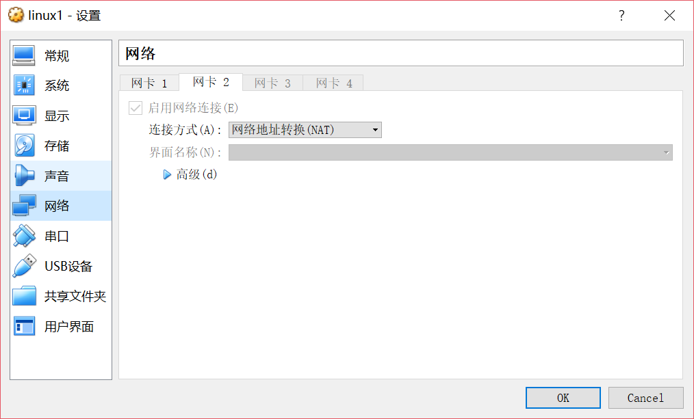
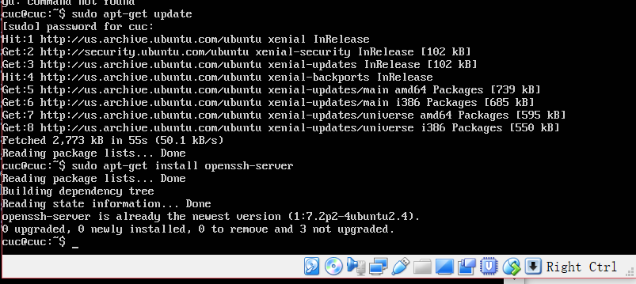
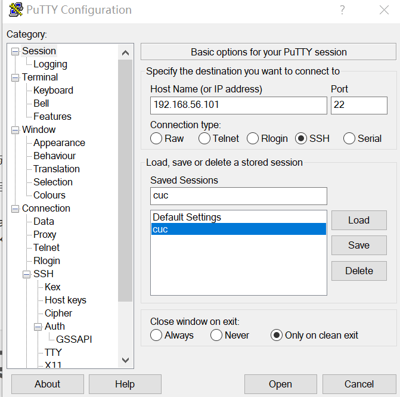
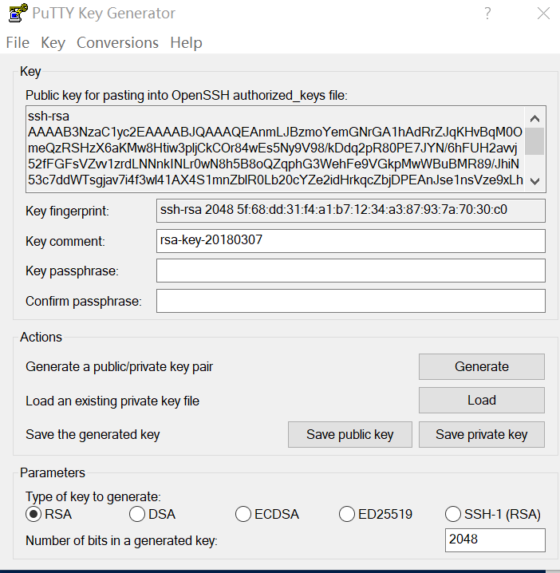

# 无人值守Linux安装镜像制作 #

---
## 一、实验要求 ##
1.定制用户名和默认密码

2.定制安装OpenSSH Server

3.安装过程禁止自动联网更新软件包

##

二、实验过程

1.安装Ubuntu系统虚拟机，使用两个网卡，安装opensssh-server

2.配置putty

通过ifconfig获得虚拟机host-only 网卡的ip，在putty中进行设置

使用puttygen生成公私钥

私钥保存并上传到putty configuration->connection->ssh->auth->private key file for authentication
公钥上传到虚拟机中命名为authorized_keys的文件，保存后打开即可远程操作虚拟机

3.按实验指导进行

-在当前用户目录下创建一个用于挂载iso镜像文件的目录
mkdir loopdir

-挂载iso镜像文件到该目录
mount -o loop ubuntu-16.04.4-server-amd64.iso loopdir

-创建一个工作目录用于克隆光盘内容
mkdir cd
 
-同步光盘内容到目标工作目录
-一定要注意loopdir后的这个/，cd后面不能有/
rsync -av loopdir/ cd

-卸载iso镜像
umount loopdir

-进入目标工作目录
cd cd/

-编辑Ubuntu安装引导界面增加一个新菜单项入口
vim isolinux/txt.cfg

将定制好的cfg通过psftp上传

重新生成md5sum.txt

修改isolinux/isolinux.cfg,增加内容timeout 10,然后输入sudo mkisofs -r -V "Custom Ubuntu Install CD" \
            -cache-inodes 
            -J -l -b isolinux/isolinux.bin 
            -c isolinux/boot.cat -no-emul-boot 
            -boot-load-size 4 -boot-info-table -o custom.iso ~/cd/

最后通过get取出镜像

---

## 三、实验理解 ##

修改默认连接超时为5s

修改dhc配置超时为5s

修改使得可以手工配置网络

手工配置ipv4

---
配置主机名和域名

---
创建一个普通账户

---
设置时间区域在上海，不使用NTP服务器设置时钟

---

自动分区设置为最大，分开/home,/var,/tmp

---
不使用网络镜像

---
选择服务器版包

安装openssh-server

不更新

---

## 四、参考 ##

[https://www.centos.org/docs/5/html/Deployment_Guide-en-US/ch-lvm.html](https://www.centos.org/docs/5/html/Deployment_Guide-en-US/ch-lvm.html "LVM")

[http://blog.chinaunix.net/uid-14348211-id-2821149.html](http://blog.chinaunix.net/uid-14348211-id-2821149.html)
