# 第六章：SHELL脚本编程练习进阶（实验） #
---
## FTP、NFS、DHCP、DNS、Samba服务器的自动安装与自动配置 ##

**FTP**

- 实现匿名访问的FTP服务器，匿名访问者可以访问1个目录且仅有该目录及其所有子目录的只读访问权限，默认的共享目录为/srv/ftp
  
  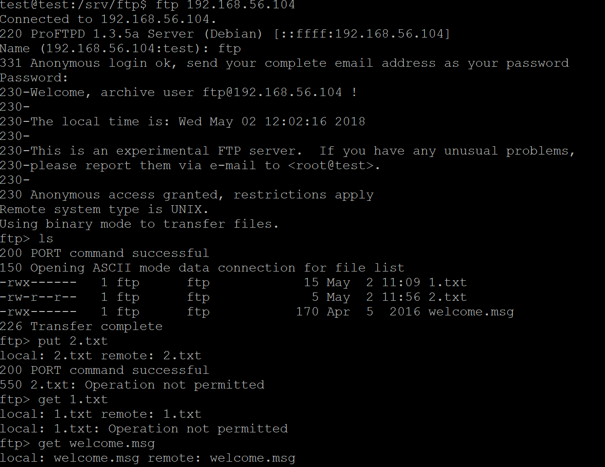
- 配置一个支持用户名和密码方式访问的账号，该账号继承匿名访问者所有权限，且拥有对另1个独立目录及其子目录完整读写（包括创建目录、修改文件、删除文件等）权限； 共享目录为/home/canyousee
  
- 该账号仅可用于FTP服务访问，不能用于系统shell登录；
  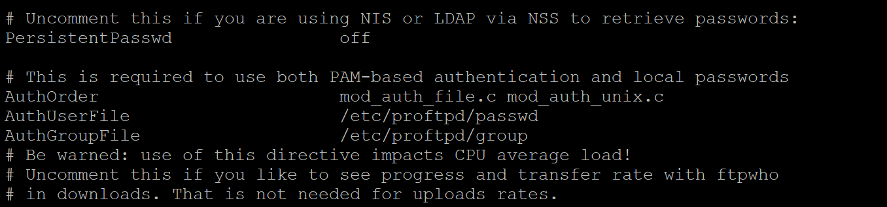
- FTP用户不能越权访问指定目录之外的任意其他目录和文件；
  
- 匿名访问权限仅限白名单IP来源用户访问，禁止白名单IP以外的访问；
  

  使用ftpasswd创建passwd和group文件

		sudo ftpasswd --passwd --file=/etc/proftpd/passwd --name=canyouseeaaa --uid=2048 --home=/home/canyouseeaaa --shell=/bin/false
        sudo ftpasswd --file=/etc/proftpd/group --group --name=loginusers --gid=1024
	 	sudo ftpasswd --group --name=loginusers --gid=1024 --member=canyousee --file=/etc/proftpd/group

参考链接：

[http://www.proftpd.org/docs/contrib/ftpasswd.html](http://www.proftpd.org/docs/contrib/ftpasswd.html)
[http://www.proftpd.org/docs/example-conf.html](http://www.proftpd.org/docs/example-conf.html)

---

**NFS**
 

- 在1台Linux上配置NFS服务，另1台电脑上配置NFS客户端挂载2个权限不同的共享目录，分别对应只读访问和读写访问权限
   服务器ip：192.168.56.104
   客户端ip：
   192.168.56.201
   
    配置一个只读一个读写访问权限，/var/nfs/test 为可读写的，/home为只读权限的
   
    具有读写访问权限的文件夹，客户端写的文件，nfs服务器端可以看到
   
    只有只读权限的文件夹，客户端不可以写文件
   
    只有只读权限的文件夹，客户端可以看到nfs服务器端共享文件夹的内容
   
- NFS客户端上看到的：
   共享目录中文件、子目录的属主、权限信息
   
   通过NFS客户端在NFS共享目录中新建的目录、创建的文件的属主、权限信息
   
        
参考链接：

[https://www.digitalocean.com/community/tutorials/how-to-set-up-an-nfs-mount-on-ubuntu-16-04](https://www.digitalocean.com/community/tutorials/how-to-set-up-an-nfs-mount-on-ubuntu-16-04)

---
**DHCP和DNS**
        
2台虚拟机使用Internal网络模式连接，其中一台虚拟机上配置DHCP服务，另一台服务器作为DHCP客户端，从该DHCP服务器获取网络地址配置

服务器配置

- 修改server的/etc/network/interfaces

- 修改server的/etc/default/isc-dhcp-server

- 修改/etc/default/bind9

- 将/etc/bind/db.local复制成/etc/bind/db.cuc.edu.cn，修改db.cuc.edu.cn,db.192.168

客户端配置

- 编辑/etc/resolvconf/resolv.conf.d/head，并且更新

	sudo resolvconf -u

参考链接：
[https://www.digitalocean.com/community/tutorials/how-to-configure-bind-as-a-private-network-dns-server-on-ubuntu-14-04](https://www.digitalocean.com/community/tutorials/how-to-configure-bind-as-a-private-network-dns-server-on-ubuntu-14-04)
---
**Samba**

server：Ubuntu；client：windows

- Ubuntu安装samba，创建共享专用用户smbuser
  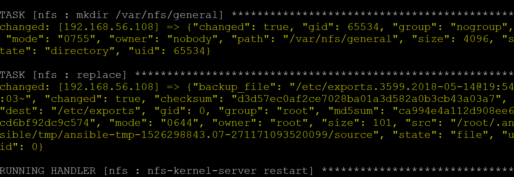
- 在/etc/samba/smb.conf里配置
  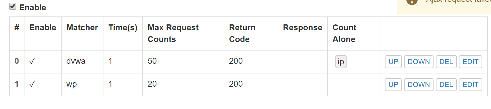
- 配置之后
  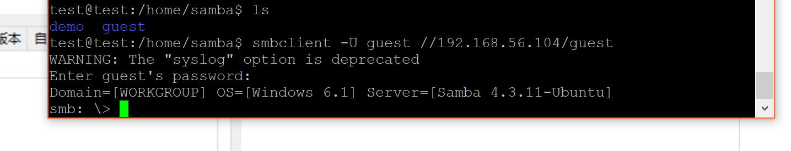
  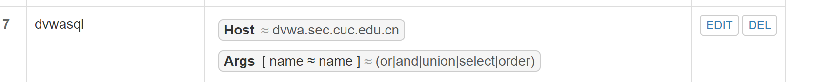
- 在客户端windows中访问
  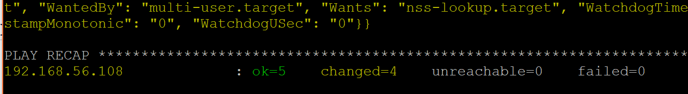
  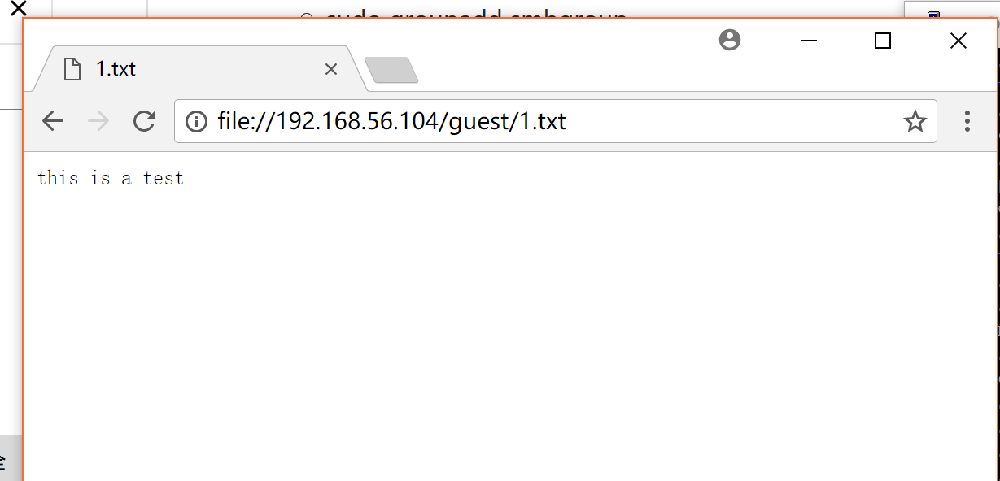
  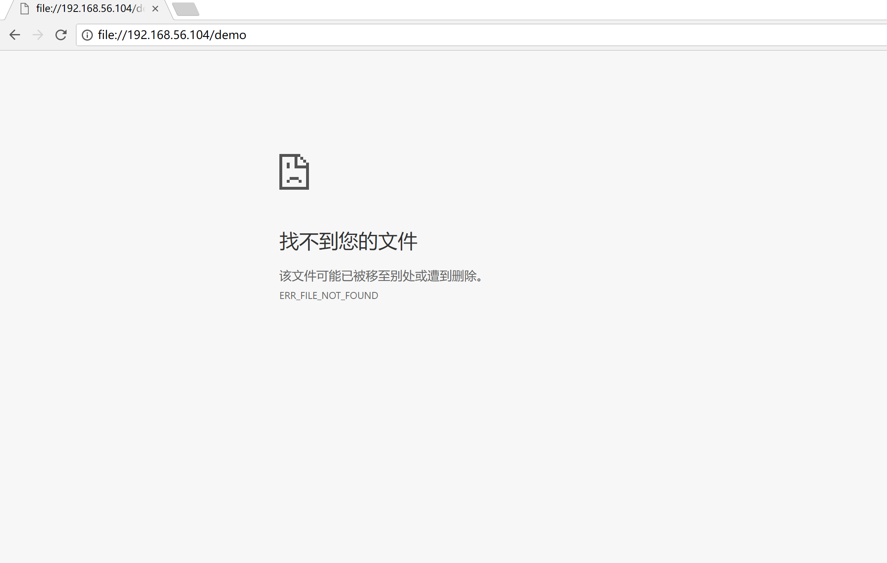

server：windows；client：ubuntu

- 在windows里配置共享
  
- 在Ubuntu中查看共享目录

	smbclient -L 192.168.56.1 -U canyousee
	smbclient -U canyousee//192.168.56.1/demo

参考链接：[https://wiki.samba.org/index.php/Setting_up_Samba_as_a_Standalone_Server](https://wiki.samba.org/index.php/Setting_up_Samba_as_a_Standalone_Server)
---

一键部署

本机准备
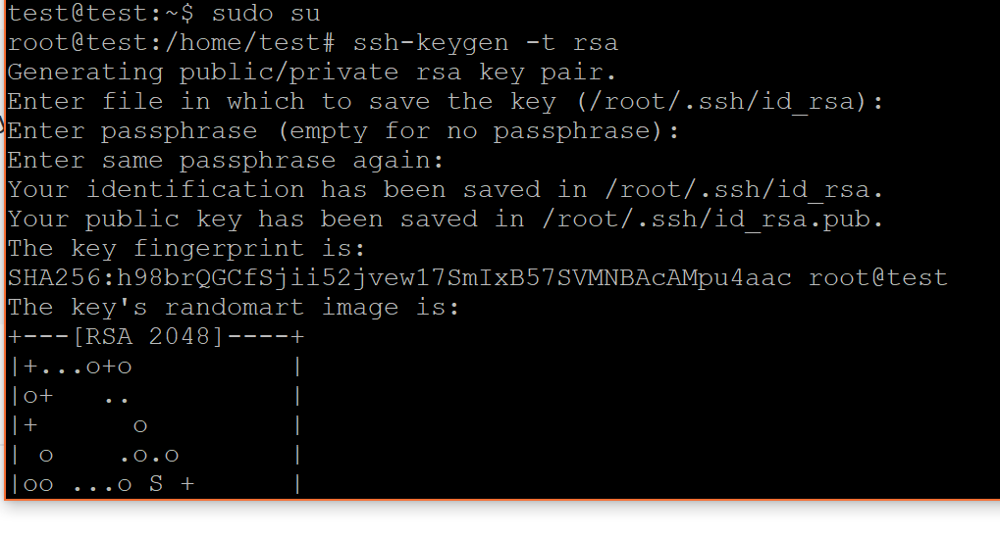
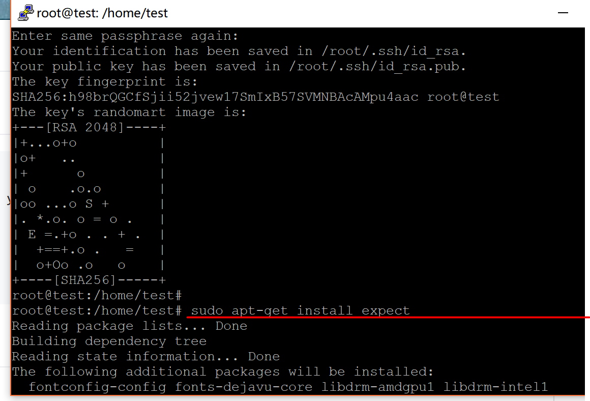

目标机准备
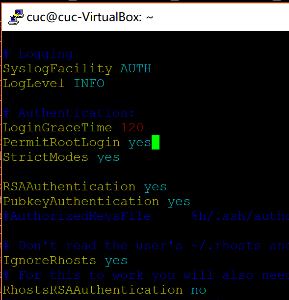

